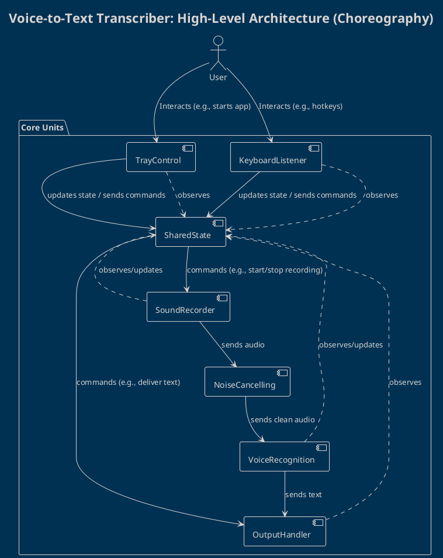
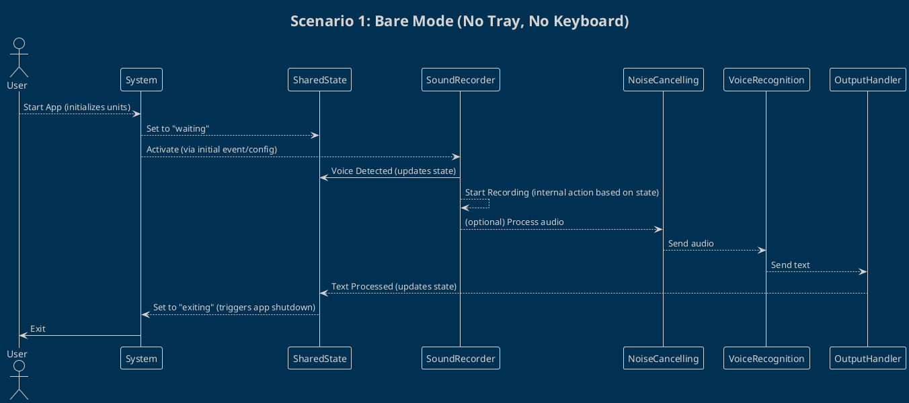
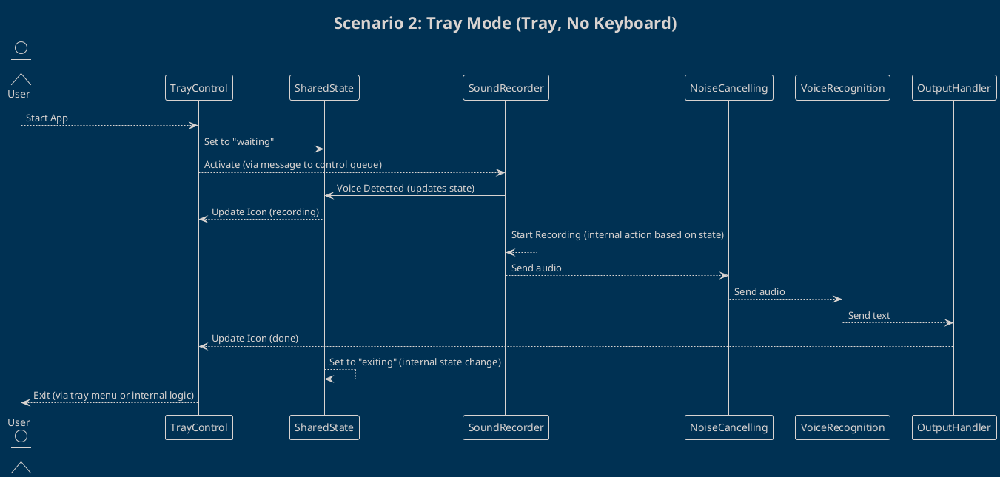

# Architecture Diagrams: Voice-to-Text Transcriber

Below are PlantUML diagrams illustrating the architecture and module interactions for all operational scenarios of the app as described in the project's general story.

---

## 1. High-Level Architecture Overview



---

## 2. Scenario 1: Bare Mode (No Tray, No Keyboard)



---

## 3. Scenario 2: Tray Mode (Tray, No Keyboard)



---

## 4. Scenario 3: Keyboard Mode (Keyboard, No Tray)

```plantuml
!theme blueprint
title Scenario 3: Keyboard Mode (Keyboard, No Tray)

actor User

User --> System: Start App (initializes units)
System --> KeyboardListener: Activate (via initial event/config)
System --> SharedState: Set to "idle"

KeyboardListener --> SharedState: Hotkey Pressed (start recording)
SharedState --> SharedState: Set to "listening" (internal state change)
SharedState --> SoundRecorder: Activate (via message to control queue)

SoundRecorder --> SharedState: Voice Detected (updates state)
SoundRecorder --> SoundRecorder: Start Recording (internal action based on state)
SoundRecorder --> NoiseCancelling: (optional) Process
NoiseCancelling --> VoiceRecognition: Send audio
VoiceRecognition --> OutputHandler: Send text
OutputHandler --> SharedState: Text Processed (updates state)

SoundRecorder --> SharedState: Silence Detected (updates state)
SharedState --> SharedState: Set to "idle" (internal state change)
KeyboardListener --> SharedState: Hotkey Pressed (stop recording)
SharedState --> SharedState: Set to "idle" (internal state change)
User --> System: Exit App (external command)

@enduml
```

---

## 5. Scenario 4: Full Mode (Tray + Keyboard)

```plantuml
!theme blueprint
title Scenario 4: Full Mode (Tray + Keyboard)

actor User

User --> System: Start App (initializes units)
System --> TrayControl: Show Tray Icon (idle)
System --> KeyboardListener: Activate (via initial event/config)
System --> SharedState: Set to "idle"

KeyboardListener --> SharedState: Hotkey Pressed (start recording)
SharedState --> SharedState: Set to "listening" (internal state change)
SharedState --> TrayControl: Update Icon (listening)
SharedState --> SoundRecorder: Activate (via message to control queue)

SoundRecorder --> SharedState: Voice Detected (updates state)
SharedState --> SharedState: Set to "recording" (internal state change)
SharedState --> TrayControl: Update Icon (recording)
SoundRecorder --> SoundRecorder: Start Recording (internal action based on state)
SoundRecorder --> NoiseCancelling: (optional) Process
NoiseCancelling --> VoiceRecognition: Send audio
VoiceRecognition --> OutputHandler: Send text
OutputHandler --> SharedState: Text Processed (updates state)
SharedState --> TrayControl: Update Icon (done)
SharedState --> SharedState: Set to "idle" (internal state change)
SharedState --> TrayControl: Update Icon (idle)

KeyboardListener --> SharedState: Hotkey Pressed (stop recording)
SharedState --> SharedState: Set to "idle" (internal state change)
SharedState --> TrayControl: Update Icon (idle)

User -> TrayControl: Exit via Tray Menu
TrayControl --> SharedState: Exit Command
SharedState --> SharedState: Set to "exiting" (internal state change)
System -> User: Exit App

@enduml
```

---

## 6. Unit Replacement/Extensibility Overview

```plantuml
!theme blueprint
title Extensibility: How Units are Swappable

package "Units" {
  interface ITrayControl
  class GnomeTray
  class WinTray
  class MacTray

  interface IKeyboardListener
  class LinuxKeyboard
  class WinKeyboard
  class MacKeyboard

  interface ISoundRecorder
  class PyAudioRecorder
  class WasapiRecorder

  interface IVoiceRecognition
  class VoskEngine
  class WhisperAPI

  interface IOutputHandler
  class ActiveWindowOutput
  class ClipboardOutput
}

ITrayControl <|.. GnomeTray
ITrayControl <|.. WinTray
ITrayControl <|.. MacTray

IKeyboardListener <|.. LinuxKeyboard
IKeyboardListener <|.. WinKeyboard
IKeyboardListener <|.. MacKeyboard

ISoundRecorder <|.. PyAudioRecorder
ISoundRecorder <|.. WasapiRecorder

IVoiceRecognition <|.. VoskEngine
IVoiceRecognition <|.. WhisperAPI

IOutputHandler <|.. ActiveWindowOutput
IOutputHandler <|.. ClipboardOutput

@enduml
```

---

**These diagrams can be rendered using any PlantUML-compatible viewer or plugin.**
