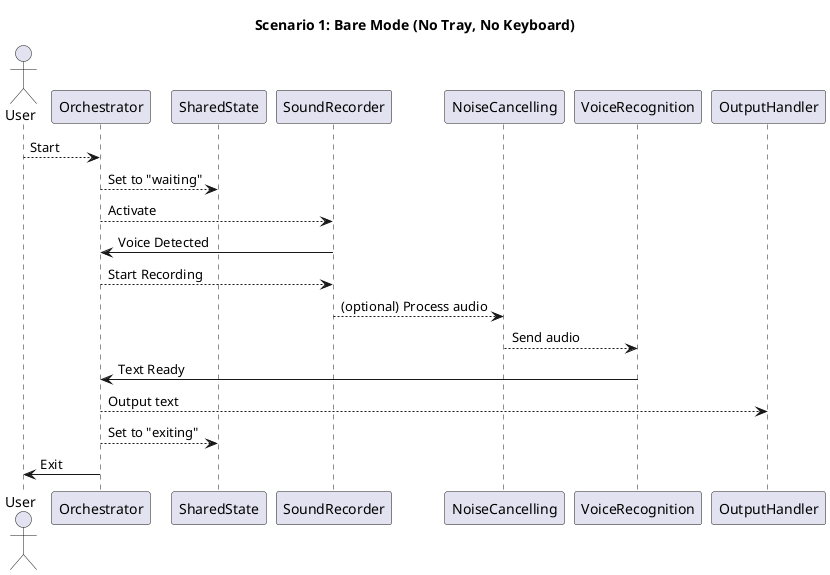
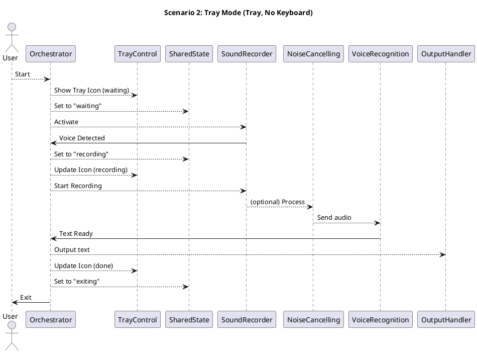
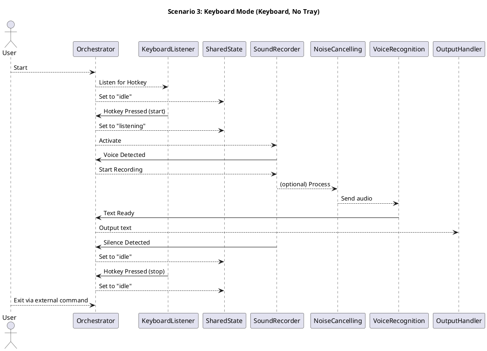
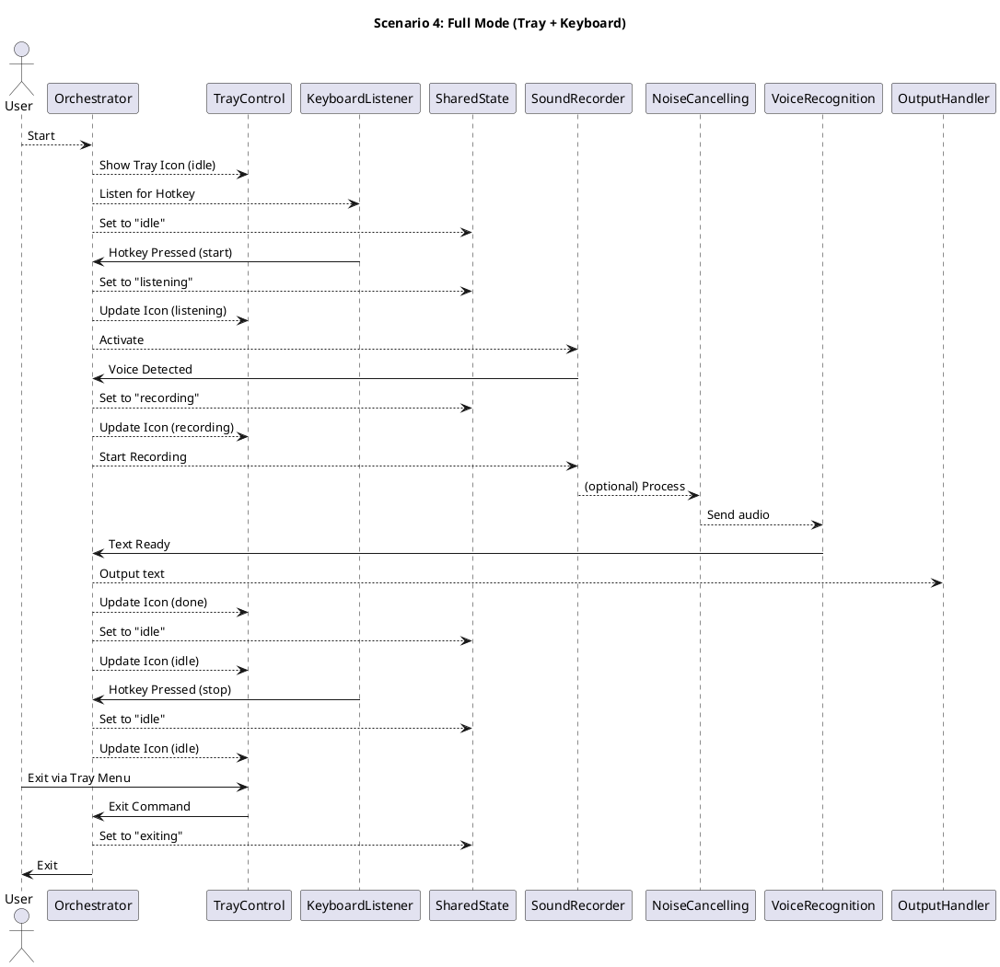
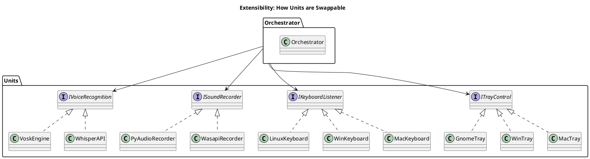

# Architecture Diagrams: Voice-to-Text Transcriber

Below are PlantUML diagrams illustrating the architecture and module interactions for all operational scenarios of the app as described in the project's general story.

---

## 1. High-Level Architecture Overview

```plantuml
@startuml
title Voice-to-Text Transcriber: High-Level Architecture

actor User

User --> Orchestrator: Starts App

package "Core Units" {
  Orchestrator
  SharedState
  TrayControl
  KeyboardListener
  SoundRecorder
  NoiseCancelling
  VoiceRecognition
  OutputHandler
}

Orchestrator --> SharedState
Orchestrator --> TrayControl
Orchestrator --> KeyboardListener
Orchestrator --> SoundRecorder
Orchestrator --> NoiseCancelling
Orchestrator --> VoiceRecognition
Orchestrator --> OutputHandler

TrayControl ..> SharedState : observes
KeyboardListener ..> SharedState : observes
SoundRecorder ..> SharedState : observes/updates
VoiceRecognition ..> SharedState : observes/updates
OutputHandler ..> SharedState : observes

SoundRecorder --> NoiseCancelling: sends audio
NoiseCancelling --> VoiceRecognition: sends clean audio
VoiceRecognition --> OutputHandler: sends text

@enduml
```

---

## 2. Scenario 1: Bare Mode (No Tray, No Keyboard)



---

## 3. Scenario 2: Tray Mode (Tray, No Keyboard)



---

## 4. Scenario 3: Keyboard Mode (Keyboard, No Tray)



---

## 5. Scenario 4: Full Mode (Tray + Keyboard)



---

## 6. Unit Replacement/Extensibility Overview



---

**These diagrams can be rendered using any PlantUML-compatible viewer or plugin.**
